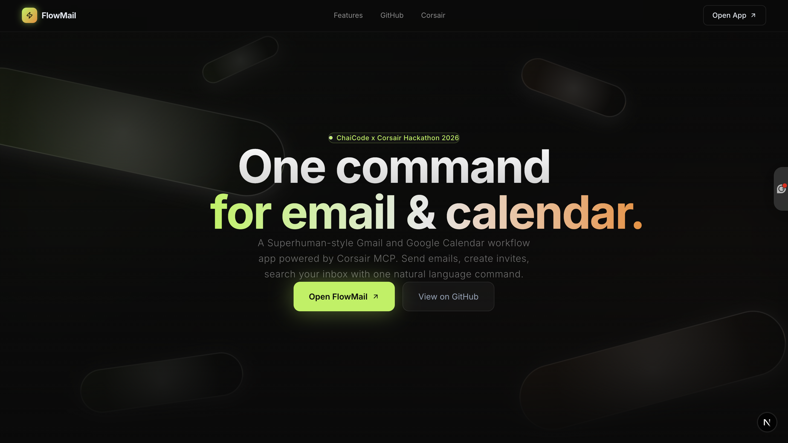
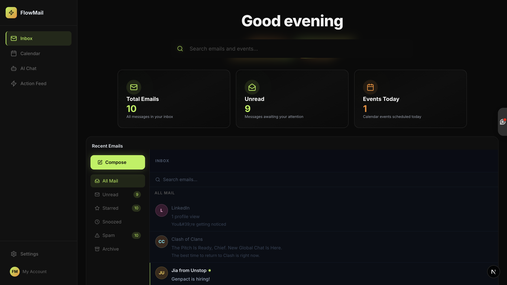
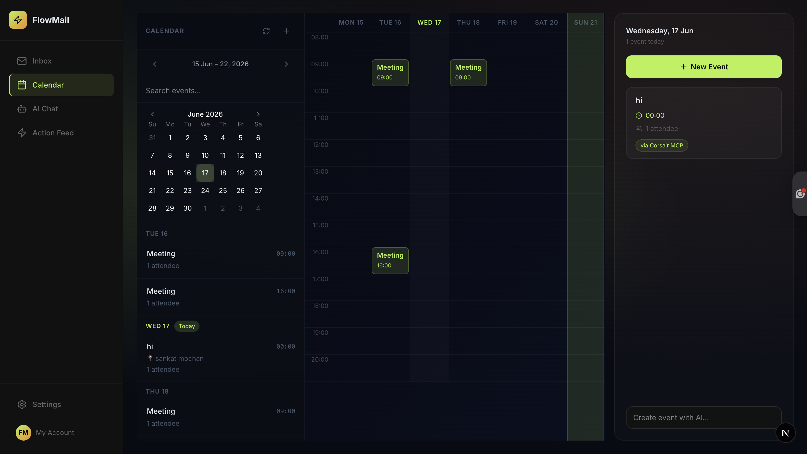
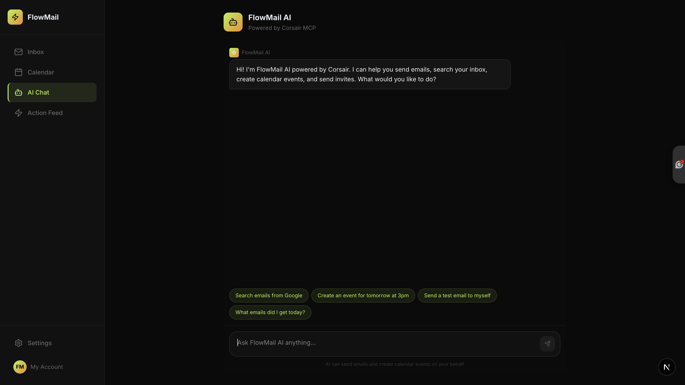
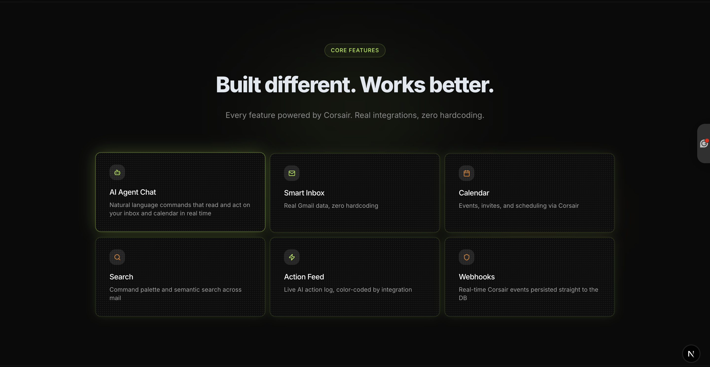

# FlowMail ⚡

> A Superhuman-style Gmail + Google Calendar workflow app powered by Corsair MCP

**Live Demo:** https://corsair-demo-nine.vercel.app  
**Built for:** ChaiCode × Corsair Hackathon 2026

---

## What is FlowMail?

FlowMail is a premium productivity app that unifies your Gmail inbox and Google Calendar into one beautiful interface — powered by Corsair's integration layer. Send emails, create calendar invites, manage your inbox, and automate workflows using natural language AI commands, all wrapped in a distinctive lime-and-orange dark UI.

## Screenshots

### Landing Page


### Dashboard Home


### Calendar — Week View


### AI Agent Chat


### Core Features



## Features

### Core
- **Smart Inbox** — Real Gmail data via Corsair, organized into All Mail, Unread, Starred, Snoozed, Spam, and Archive
- **Inline Email Actions** — Star, snooze (1hr / tomorrow / next week), report spam, and archive any email via a unified dropdown — available from both the list and the reading panel
- **Compose Window** — Floating, Gmail-style compose with To/Subject/Body fields, Send and Save Draft
- **Calendar — Week Grid View** — Real events plotted by day and hour, with a mini month picker, "Today's Events" panel, and a quick "Create event with AI..." input
- **⌘K Command Palette** — Quick actions: compose, create event, refresh inbox, open AI assistant, navigate between views
- **Dashboard Home** — Live stat cards (Total Emails, Unread, Events Today) plus a recent emails + today's events overview

### AI & MCP (Bonus)
- **AI Agent Chat** — Natural language commands via Corsair MCP (GPT-4o-mini), rendered as its own full-page view
  - "Send a calendar invite to john@example.com at 9 AM next Thursday"
  - "Send him an email saying I look forward to our meeting"
  - Executes both actions in one conversation
- **Live AI Action Feed** — Real-time, color-coded log of every AI agent action (email sent, invite sent, inbox searched) with timestamps, in a slide-in side panel
- **Semantic Search** — OpenAI-powered natural language → Gmail search syntax

### Productivity UX (Bonus)
- **Keyboard Shortcuts** — ⌘K command palette, ⌘/ AI chat toggle, ⌘↵ send
- **Toast Notifications** — For every star/snooze/spam/archive/send action
- **"Via Gmail API · Corsair MCP" badges** — On every email and calendar event, proving live data over mocked data
- **Animated Glowing Search Bar** — Ambient lime glow on the dashboard home search, intensifying on hover/focus
- **Empty States** — Clean iconography for empty Snoozed/Spam/Archive views
- **Settings Page** — Integrations status, shortcuts reference

### Engineering
- **Real-time Webhooks** — Corsair webhook endpoint with PostgreSQL event storage
- **LLM Priority Filtering** — AI determines intent and routes to the correct action
- **Corsair Search API** — Real email search via Corsair Gmail API
- **Zero hardcoded data** — All emails, events, and counts come from live Corsair integrations

### UI/UX Design System
- **Nixtio-Inspired Dark Theme** — `#0A0A0A` base with lime `#B4F24A` primary accent and orange `#F28C28` secondary accent
- **Landing Page Hero** — Floating animated pill shapes with a lime-to-orange gradient headline
- **Typography** — Bold, tight-tracking headings (fontWeight 800, letterSpacing -0.02em) for a confident, modern feel
- **Single Icon Sidebar** — Inbox, Calendar, AI Chat, Action Feed, with active-state lime highlight and left accent border
- **Colored Sender Avatars** — Initials with hashed color per sender
- **Unread Indicators** — Lime dot on unread emails
- **Calendar Week Grid** — Lime-bordered event blocks placed by real time/day, current day column highlighted
- **Highlight Stat Cards** — Icon-led cards with subtle hover glow and pulse ring, used on the dashboard home
- **Live AI Action Feed** — Color-coded entries (lime = email, orange = calendar, lime = search) with relative timestamps
- **Corsair MCP Badge** — Animated rotating lime/orange gradient border with a live pulse indicator
- **Command Palette** — Linear-style ⌘K with quick actions, lime-highlighted selection state
- **Compose Window** — Floating Gmail-style with minimize/maximize and a lime Send button
- **Toast Notifications** — Lime/orange-accented toasts for every action

---

## Corsair Features Used

| Feature | Implementation |
|---|---|
| `gmail.api.messages.list` | Inbox loading + category filtering |
| `gmail.api.messages.get` | Email detail / reading panel |
| `gmail.api.messages.send` | Send emails (direct compose + via AI) |
| `gmail.api.drafts.create` | Save drafts |
| `googlecalendar.api.events.getMany` | Calendar week view + today's events |
| `googlecalendar.api.events.create` | Create events + send invites |
| Corsair MCP Agent | Natural language email + calendar automation |
| Webhook endpoint | Real-time Corsair event processing |

---

## Bonus Tasks Completed

- ✅ **Corsair MCP agent chat** (highest value)
- ✅ **Real-time webhooks** — `/api/webhooks` with DB storage
- ✅ **LLM priority filtering** — GPT-4o-mini routes actions
- ✅ **Keyboard shortcuts** — ⌘K, ⌘/, ⌘↵
- ✅ **Corsair search API** — semantic email search
- ✅ **Semantic search** — natural language → Gmail query via OpenAI

---

## Tech Stack

| Technology | Version |
|---|---|
| Next.js | 15 |
| React | 19 |
| tRPC | 11 |
| Drizzle ORM | latest |
| PostgreSQL | (Neon hosted) |
| Corsair | latest |
| TypeScript | 5 |
| OpenAI | GPT-4o-mini |

---

## Setup

### 1. Install dependencies

```bash
pnpm i @t3-oss/env-nextjs@latest
pnpm i corsair @corsair-dev/gmail @corsair-dev/googlecalendar @corsair-dev/cli
```

### 2. Google Cloud Setup

Create a new project at https://console.cloud.google.com/projectcreate

Enable Gmail API and Google Calendar API.

### 3. Corsair Setup

```bash
# Set up Gmail
pnpm corsair setup --gmail client_id=CLIENT_ID client_secret=CLIENT_SECRET

# Set up Google Calendar (same credentials)
pnpm corsair setup --googlecalendar client_id=CLIENT_ID client_secret=CLIENT_SECRET

# Authenticate (replace 'dev' with your tenant ID)
pnpm corsair auth --plugin=gmail --tenant=dev
pnpm corsair auth --plugin=googlecalendar --tenant=dev
```

### 4. Webhooks (optional)

```bash
# Set up Ngrok pointing to localhost
pnpm corsair auth --plugin=gmail --webhooks
pnpm corsair auth --plugin=googlecalendar --webhooks
```

### 5. Environment Variables

```env
DATABASE_URL=postgresql://...
CORSAIR_KEK=...
TENANT_ID=dev
CORSAIR_DEV_KEY=...
CORSAIR_INSTANCE_ID=...
OPENAI_API_KEY=...
```

### 6. Database

```bash
pnpm db:push
pnpm dev
```

---

## Demo

Open `http://localhost:3000` → redirects to landing page  
Click **"Open FlowMail"** → full app at `/app`

**AI Agent demo:**
> "Send a calendar invite to friend@corsair.dev at 9 AM next Thursday. Send him an email too saying I look forward to our meeting."

The AI will execute both actions in sequence via Corsair MCP.

**Inbox demo:**
> Click the three-dot menu on any email (or use the toolbar inside an opened email) to mark as star, snooze, report spam, or archive — all reflected instantly in the sidebar category counts.

---

## Built by

**Chaitanya Pal** — ChaiCode × Corsair Hackathon 2026  
Powered by [Corsair](https://corsair.dev)