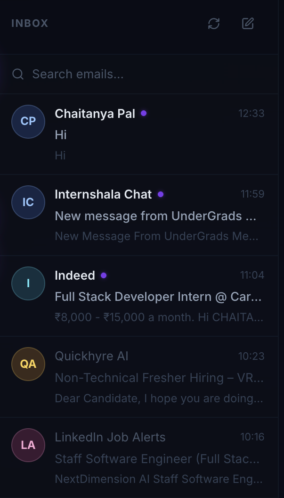
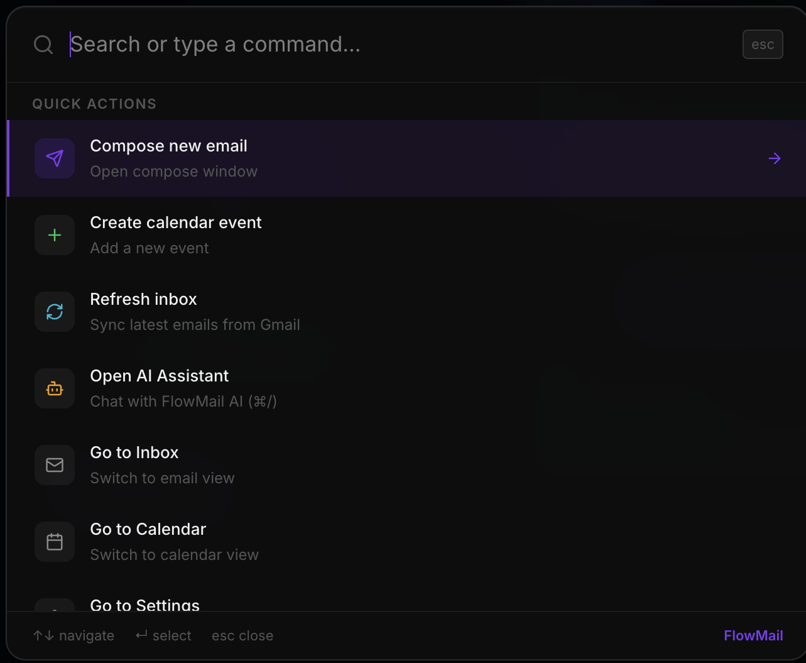
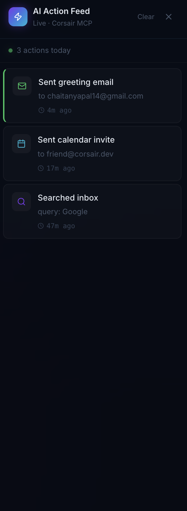

# FlowMail ⚡

> A Superhuman-style Gmail + Google Calendar workflow app powered by Corsair MCP

**Live Demo:** https://corsair-demo-nine.vercel.app  
**Built for:** ChaiCode × Corsair Hackathon 2026

---

## What is FlowMail?

FlowMail is a premium productivity app that unifies your Gmail inbox and Google Calendar into one beautiful interface — powered by Corsair's integration layer. Send emails, create calendar invites, and automate workflows using natural language AI commands.

## Screenshots

### Landing Page


### Smart Inbox


### AI Agent Chat


### ⌘K Command Palette


### Live AI Action Feed


## Features

### Core
- **Smart Inbox** — Real Gmail data via Corsair. Search, read, reply, and compose emails
- **Calendar Integration** — Week view, event creation, and invite sending
- **⌘K Command Palette** — Quick actions: compose, refresh, navigate, open AI
- **Floating Compose Window** — Gmail-style compose with minimize/maximize
- **Glassmorphism UI** — Deep navy color system with premium dark aesthetics

### AI & MCP (Bonus)
- **AI Agent Chat** — Natural language commands via Corsair MCP (GPT-4o-mini)
  - "Send a calendar invite to john@example.com at 9 AM next Thursday"
  - "Send him an email saying I look forward to our meeting"
  - Executes both actions in one conversation
- **Live AI Action Feed** — Real-time log of all AI agent actions (color-coded by type)
- **Semantic Search** — OpenAI-powered natural language → Gmail search syntax

### Productivity UX (Bonus)
- **Keyboard Shortcuts** — ⌘K search, ⌘/ AI chat, ⌘↵ send
- **Toast Notifications** — Glassmorphism toasts for every action
- **Skeleton Loading** — Shimmer animation on email list
- **Empty States** — Animated SVG illustrations
- **Mobile Navbar** — Bottom navigation on mobile
- **Settings Page** — Integrations status, shortcuts reference

### Engineering
- **Real-time Webhooks** — Corsair webhook endpoint with PostgreSQL event storage
- **LLM Priority Filtering** — AI determines intent and routes to correct action
- **Corsair Search API** — Real email search via Corsair Gmail API
- **Zero hardcoded data** — All data from live Corsair integrations

---

## Corsair Features Used

| Feature | Implementation |
|---|---|
| `gmail.api.messages.list` | Inbox loading + search |
| `gmail.api.messages.get` | Email detail view |
| `gmail.api.messages.send` | Send emails (direct + via AI) |
| `gmail.api.drafts.create` | Save drafts |
| `googlecalendar.api.events.getMany` | Calendar week view |
| `googlecalendar.api.events.create` | Create events + send invites |
| Corsair MCP Agent | Natural language email + calendar automation |
| Webhook endpoint | Real-time Corsair event processing |

---

## Bonus Tasks Completed

- ✅ **Corsair MCP agent chat** (highest value)
- ✅ **Real-time webhooks** — `/api/webhooks` with DB storage
- ✅ **LLM priority filtering** — GPT-4o-mini routes actions
- ✅ **Keyboard shortcuts** — ⌘K, ⌘/, ⌘↵
- ✅ **Corsair search API** — semantic email search
- ✅ **Semantic search** — natural language → Gmail query via OpenAI

---

## Tech Stack

| Technology | Version |
|---|---|
| Next.js | 15 |
| React | 19 |
| tRPC | 11 |
| Drizzle ORM | latest |
| PostgreSQL | (Neon hosted) |
| Corsair | latest |
| TypeScript | 5 |
| OpenAI | GPT-4o-mini |

---

## Setup

### 1. Install dependencies

```bash
pnpm i @t3-oss/env-nextjs@latest
pnpm i corsair @corsair-dev/gmail @corsair-dev/googlecalendar @corsair-dev/cli
```

### 2. Google Cloud Setup

Create a new project at https://console.cloud.google.com/projectcreate

Enable Gmail API and Google Calendar API.

### 3. Corsair Setup

```bash
# Set up Gmail
pnpm corsair setup --gmail client_id=CLIENT_ID client_secret=CLIENT_SECRET

# Set up Google Calendar (same credentials)
pnpm corsair setup --googlecalendar client_id=CLIENT_ID client_secret=CLIENT_SECRET

# Authenticate (replace 'dev' with your tenant ID)
pnpm corsair auth --plugin=gmail --tenant=dev
pnpm corsair auth --plugin=googlecalendar --tenant=dev
```

### 4. Webhooks (optional)

```bash
# Set up Ngrok pointing to localhost
pnpm corsair auth --plugin=gmail --webhooks
pnpm corsair auth --plugin=googlecalendar --webhooks
```

### 5. Environment Variables

```env
DATABASE_URL=postgresql://...
CORSAIR_KEK=...
TENANT_ID=dev
CORSAIR_DEV_KEY=...
CORSAIR_INSTANCE_ID=...
OPENAI_API_KEY=...
```

### 6. Database

```bash
pnpm db:push
pnpm dev
```

---

## Demo

Open `http://localhost:3000` → redirects to landing page  
Click **"Open FlowMail"** → full app at `/app`

**AI Agent demo:**
> "Send a calendar invite to friend@corsair.dev at 9 AM next Thursday. Send him an email too saying I look forward to our meeting."

The AI will execute both actions in sequence via Corsair MCP.

---

## Built by

**Chaitanya Pal** — ChaiCode × Corsair Hackathon 2026  
Powered by [Corsair](https://corsair.dev)
